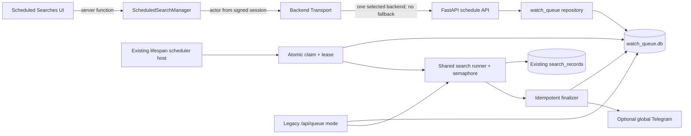
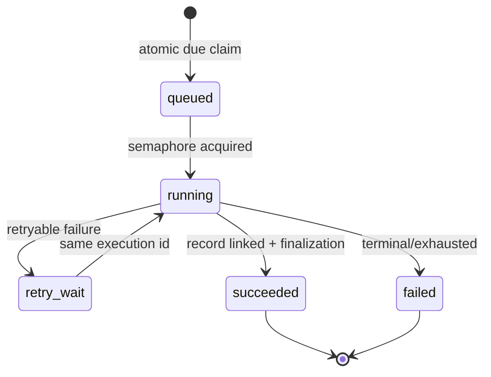

# Design Document: Scheduled Recurring Car Search

## Overview

Feature rozszerza potwierdzony mechanizm Ubuntu `watch queue` o jawnie odrębny typ `scheduled_recurring_v1`, wykonywany bez końca niezależnie od liczby wyników. Nie powstaje drugi scheduler: nowe wpisy współdzielą istniejący lifespan worker, search pipeline i semaphore z Legacy_Retry_Queue, ale mają osobny kontrakt CRUD/toggle/history oraz kontrolowane, addytywne pola i ledger wykonań.

Ubuntu FastAPI jest authoritative ownerem konfiguracji, zegara, lease, wykonania i metadanych. Lovable/TanStack Start pozostaje uwierzytelnionym BFF-em i GUI. Wszystkie management calls przechodzą przez `backend-transport.server.ts`; Cloudflare Worker nie jest long-running schedulerem.

### Cele

- CRUD, idempotentne delete, toggle, globalna lista i historia wykonań.
- Immutable owner Site_User pochodzący wyłącznie z podpisanej sesji.
- Atomowy limit domyślnie 20 aktywnych schedule per owner.
- Dokładnie jeden Search_Record dla każdego udanego execution, także z zero wyników; brak Search_Record dla failure.
- Lease, idempotency, retry/backoff, restart recovery i brak równoległego wykonania tego samego terminu.
- Opcjonalny globalny Telegram, domyślnie off.
- Koegzystencja z legacy retry bez reinterpretacji, kopiowania ani destrukcyjnej migracji istniejących rows.

### Poza zakresem

- Migracja/adopcja istniejących legacy rows do nowego typu.
- Per-user Telegram/chat ID oraz deduplikacja ofert między execution.
- Ręczne „run now”, calendar cron i `preferred_hour`; v1 obsługuje 1–168 pełnych godzin, a „codziennie” = 24.
- Scheduler utrzymywany przez Lovable BFF/Cloudflare.

### Potwierdzone discovery (read-only, 2026-07-21)

Discovery wykonano lokalnie oraz przez `ssh wsl2-cf-kiro`; nie odczytywano zawartości SQLite, nie restartowano i nie zmieniano produkcji.

- Lokalny `queue.functions.ts` udostępnia tylko create/list/delete. `scraper-queue.server.ts` woła bezpośrednio `SCRAPER_BASE_URL/api/queue`, pomijając unified transport.
- Aktywny `usacar-api.service` jest `active/running`; Uvicorn PID 23164 ładuje release `/opt/usacar/releases/ebf176d-caf6b6e596ec/usa-car-finder`, bind `127.0.0.1:8000`.
- Aktywny OpenAPI potwierdza `POST/GET /api/queue` i `DELETE /api/queue/{watch_id}`. `QueueWatchRequest` ma `search`, `interval_hours`, `label`, `chat_id`, `recurring`, `preferred_hour`.
- Lifespan inicjalizuje `watch_queue.db` i uruchamia `_watch_queue_loop`; tick domyślnie 60 s. `_run_job_with_queue` współdzieli semaphore `SEARCH_MAX_CONCURRENT` (domyślnie 1).
- `watch_entries` ma interval/next/last/runs/result/active/status oraz addytywne `recurring` i `preferred_hour`. Nie ma ownera, edit/toggle, per-user limitu, execution ledger ani claim lease.
- Obecne API clampuje/defaultuje interval zamiast odrzucać invalid input, GET pokazuje wyłącznie active, a powtórzony DELETE zwraca 404.
- Obecny recurring path po exception może potraktować job jak wynik 0 i zwiększyć licznik; wysyła globalny Telegram również przy zero wyników. To jest niezgodne z wymaganiami.
- Search pipeline zapisuje rekord z `job_id`; startup backfill zapisuje terminalne error/cancelled/interrupted records. Scheduled runner musi jawnie wyłączyć failure-record persistence.
- Middleware dostarcza `context.siteUser`, lecz obecny `backendSearch` nie propaguje go; backendowy `ClientCriteria` nie ma `searched_by`.
- Lokalny `criteriaSchema` dopuszcza max_results 100 i copart/iaai/manheim; aktywny backend capuje do 15 i akceptuje tylko copart/iaai. GUI rollout wymaga wcześniejszego ujednolicenia capability/schema, bez silent clamp.
- Supabase migration jedynie włącza `pg_cron`/`pg_net`; nie istnieje schedule. Public cleanup hook pokazuje wzorzec server-only bearer + `timingSafeEqual`.

Źródła: [`src/functions/queue.functions.ts`](../../../src/functions/queue.functions.ts), [`src/server/scraper-queue.server.ts`](../../../src/server/scraper-queue.server.ts), [`src/server/backend-transport.server.ts`](../../../src/server/backend-transport.server.ts), [`docs/ubuntu-api-contract.md`](../../../docs/ubuntu-api-contract.md), wdrożone read-only `api/main.py`, `api/watch_queue_db.py`, `api/client_database.py` i aktywny OpenAPI.

### Rozstrzygnięcie niewiadomych z requirements

| Niewiadoma                | Decyzja v1                                                                                                                                                                                                                                          |
| ------------------------- | --------------------------------------------------------------------------------------------------------------------------------------------------------------------------------------------------------------------------------------------------- |
| Execution engine          | Istniejący lifespan scheduler/worker na Ubuntu zostaje hostem zegara i współdzieli semaphore z legacy. Cloudflare BFF nie wykonuje długich zadań.                                                                                                   |
| Ubuntu `/api/queue`       | Discovery potwierdziło aktywne `POST/GET/DELETE /api/queue`; nowe `/api/queue/schedules` są addytywnym, wersjonowanym kontraktem wymagającym capability `scheduled_searches_v1`.                                                                    |
| Koegzystencja legacy      | Bez migracji i bez reinterpretacji: `schedule_kind IS NULL` zachowuje retry-until-found, `scheduled_recurring_v1` ma stały cykl niezależny od wyniku.                                                                                               |
| Authoritative persistence | Ubuntu FastAPI/watch worker jest jedynym source of truth dla schedule, lease, ledger, zegara i execution; BFF/Supabase nie przechowuje kopii. Backend_Transport nadal wybiera transport, ale v1 capability jest publikowane wyłącznie przez Ubuntu. |
| Powiadomienia             | V1 używa opcjonalnego globalnego Telegrama instalacji, default off; brak per-user chat ID.                                                                                                                                                          |
| Limit                     | `MAX_ACTIVE_SCHEDULES` ma default 20 per immutable owner; jawna wartość musi być integer ≥1.                                                                                                                                                        |
| Criteria compatibility    | Rollout jest blokowany, dopóki wspólny capability/schema nie odrzuca, zamiast clampować, unsupported `sources` i `max_results`.                                                                                                                     |

## Architecture



### Ownership decisions

1. **Scheduler/persistence:** Ubuntu FastAPI/watch worker owns both. Lovable/Supabase stores no schedule copy, avoiding split brain and allowing execution while GUI is unavailable. BFF still reaches management API only through Backend_Transport; selecting legacy in v1 yields capability-unavailable, never a direct Ubuntu bypass or fallback.
2. **One scheduler host, two modes:** existing loop dispatches legacy rows to existing retry-until-found handler and rows marked `schedule_kind='scheduled_recurring_v1'` to the new handler. Both use the same semaphore.
3. **Controlled additive migration:** add nullable/default-safe columns and new `schedule_executions`, `schedule_execution_attempts` i `schedule_notifications` tables in `watch_queue.db`. Existing rows are not backfilled, copied, deleted or reclassified; `schedule_kind IS NULL` always follows old code.
4. **Record linkage and idempotency:** ledger stores unique `record_id`/`job_id`, a deterministic job ID identifies the execution in the existing record store, and record creation is `insert-or-read-existing` under a unique non-null job-ID constraint. Schedule history joins through API lookups; no schedule foreign-key column is required on Search_Record.
5. **Fixed delay with concurrent edits:** after terminal success/failure, `next_run_at = finished_at + current persisted schedule.interval_hours`. Search criteria and attribution come from the immutable execution snapshot, but a valid interval edit made during execution wins for the next term; finalizer never overwrites newer criteria/version. No missed-interval burst and no `preferred_hour` semantics.
6. **Soft delete:** externally removed schedule is marked `deleted_at`, `active=0`, `next_run_at=NULL`. Ledger and Search_Record remain. Already claimed execution completes from its immutable snapshot.
7. **At-least-once work, exactly-once effects:** claim may be recovered after lease expiry, while unique execution/job/record keys, fenced lease generations and compare-and-set finalization prevent duplicate terminal effects.

### Management flow and identity

```mermaid
sequenceDiagram
  actor U as Site_User
  participant UI
  participant BFF as ScheduledSearchManager
  participant BT as BackendTransport
  participant API as FastAPI
  participant DB as QueueStore
  U->>UI: create/edit/toggle/delete/list
  UI->>BFF: strict client payload, no owner
  BFF->>BFF: siteSessionMiddleware first
  BFF->>BT: request + actorSiteUser=session.sub
  BT->>API: service auth + X-Site-User
  API->>API: actor allowlist + strict schema
  API->>DB: BEGIN IMMEDIATE; invariant + mutation
  DB-->>API: committed aggregate
  API-->>BFF: versioned sanitized DTO
  BFF-->>UI: allowlisted response/error
```

`owner_site_user`, `searched_by`, counters, status and timestamps are forbidden client input. `BackendRequest` gains a server-only `actorSiteUser`; transport validates it against `SITE_USERS` and sets `X-Site-User` for both branches. Browser-controlled arbitrary headers are impossible. Backend requires the actor for schedule management and stores it as immutable owner. During execution it copies owner into the trusted record criteria snapshot as `searched_by`; client payload can never override it.

Wszystkie authenticated Site_User widzą i mogą zarządzać globalną listą, zgodnie z wymaganiami operatorskimi. Owner oznacza immutable attribution i limit bucket, nie owner-only ACL. Mutacja przez innego operatora nie zmienia ownera; audit zapisuje actor osobno.

### Worker, locking and retries



Scheduler co 30–60 s wykonuje krótkie `BEGIN IMMEDIATE`. Dla każdego due, enabled, non-deleted schedule atomowo tworzy albo odzyskuje ledger row o unikalnym `(schedule_id, scheduled_for)`, zapisuje immutable owner/criteria/interval snapshot, przypina deterministyczny `job_id = "schedule:" + execution_id` i nadaje losowy lease token wraz z rosnącym `lease_generation` i expiry. Claim nie może utworzyć drugiego execution dla tego samego terminu. Scraping odbywa się poza transakcją i pod wspólnym `SEARCH_MAX_CONCURRENT` semaphore. Heartbeat odnawia lease wyłącznie przez compare-and-set token+generation; takeover po expiry zachowuje execution ID i job ID. Każdy zapis attempt/finalize również wymaga aktualnego fencing generation, więc stary worker po utracie lease nie może zatwierdzić efektów.

Jedna Schedule_Execution ma maksymalnie 3 search attempts: natychmiast, po 30 s i po 120 s, z jitter ±20%. Retryable: network, timeout, 502/503/504 i interrupted process. Terminal: 4xx, invalid snapshot, unavailable capability albo exhausted attempts. Wszystkie próby używają `Idempotency-Key: schedule-execution/{execution_id}` i tego samego job ID. Jeśli job lub Search_Record już istnieje, recovery odczytuje jego terminalny stan zamiast ponownie uruchamiać scraping.

Backend_Transport jest wyłącznie granicą management BFF→wybrany Backend. Po zapisaniu schedule authoritative Ubuntu worker wywołuje lokalny, współdzielony search pipeline bez loop-backu przez Lovable. Search_Record writer wykonuje `insert-or-read-existing` po globalnie unikalnym `job_id`; unikalność musi być wymuszona w tej samej bazie co Search_Record. Jeśli staging schema nie potwierdzi strukturalnie takiego constraintu, Etap A dodaje częściowy unique index na non-null `job_id` przed włączeniem worker capability. Crash po utworzeniu rekordu, ale przed finalizacją ledger, jest odzyskiwany przez lookup tego samego job ID. Dopiero istniejący rekord pozwala na idempotentne `execution→succeeded`; `result_count=0` nadal tworzy dokładnie jeden rekord.

Search runner używa `suppress_completion_notify=true` i `persist_failure_record=false`; globalny terminal-record backfill musi pomijać jobs oznaczone jako scheduled failure. Terminal failure może zostać zatwierdzony tylko, gdy lookup po job ID nie znajduje Search_Record; zapisuje ledger/schedule error, nie zwiększa `runs_count` i nie tworzy rekordu. Jeśli scraping zakończył się sukcesem, lecz linkowanie zawiodło, worker ponawia wyłącznie lookup/finalizację, nigdy scraping ani record creation z nową tożsamością.

### No Lovable/Supabase scheduler fallback

V1 nie używa `pg_cron`, `pg_net`, publicznego tick hooka, GitHub Actions ani Cloudflare Worker jako zegara lub execution hosta. Potwierdzony lifespan worker Ubuntu jest authoritative ownerem czasu, claimów i execution. Jeśli worker capability lub heartbeat jest niedostępny, system degraduje readiness i GUI pokazuje `capability_unavailable`; nie uruchamia drugiego schedulera. Ewentualna przyszła zmiana hosta zegara wymaga osobnej specyfikacji i protokołu przejęcia ownership, nie runtime fallbacku.

## Components and Interfaces

### 1. `ScheduledSearchManager` (BFF)

Nowe server functions, wszystkie z `siteSessionMiddleware` przed validator:

- `createScheduledSearch` → `POST /api/queue/schedules`
- `updateScheduledSearch` → `PATCH /api/queue/schedules/{id}`
- `setScheduledSearchEnabled` → `PUT /api/queue/schedules/{id}/state`
- `deleteScheduledSearch` → `DELETE /api/queue/schedules/{id}`
- `listScheduledSearches` → `GET /api/queue/schedules`
- `getScheduledSearch` → `GET /api/queue/schedules/{id}`
- `listScheduledSearchExecutions` → `GET /api/queue/schedules/{id}/executions?cursor=&limit=`

Implementacja Lovable trafia wyłącznie do canonical repo: odpowiedniki unified transportu i adaptera schedule w `src/lib/backend-transport.server.ts` oraz innych `src/lib/*.server.ts`, a publiczne server functions pozostają cienką warstwą z `siteSessionMiddleware` przed validatorem. Nazwy z lokalnego, starszego checkoutu `src/server/*.server.ts` służą tylko do zrozumienia zachowania i nie wyznaczają ścieżek docelowych.

Manager używa strict Zod request/response schemas oraz wyłącznie `backendRequest`. Nie czyta `UBUNTU_*`, `CF_ACCESS_*`, `API_BASE_URL`, `SCRAPER_*`, nie wykonuje direct fetch i nie wybiera transportu. Błąd transportu jest mapowany na publiczny code/message bez raw `body`, URL, tokena lub headers.

Capability `scheduled_searches_v1` jest warunkiem włączenia GUI i w v1 jest publikowane wyłącznie przez authoritative Ubuntu. Gdy Backend_Transport zgodnie z konfiguracją wybiera legacy, brak capability/404 jest widocznym deployment error; manager nie omija selektora, nie woła Ubuntu bezpośrednio, nie wykonuje runtime fallbacku i nie używa starego `/api/queue`. Ewentualne przeniesienie ownership do legacy wymaga osobnej specyfikacji.

### 2. FastAPI schedule API

Endpointy są nowym projektowanym kontraktem; discovery potwierdziło tylko istniejące `/api/queue`:

| Method/path                                | Request                                             | Success                       | Reguła                                                              |
| ------------------------------------------ | --------------------------------------------------- | ----------------------------- | ------------------------------------------------------------------- |
| `POST /api/queue/schedules`                | `CreateScheduledSearchRequest`                      | `201 ScheduledSearchEnvelope` | strict validation przed transakcją limitu; owner z trusted actor    |
| `GET /api/queue/schedules`                 | brak                                                | `200 ScheduledSearchList`     | wszystkie native non-deleted; next_run ASC, NULL last, id tie-break |
| `GET /api/queue/schedules/{id}`            | brak                                                | `200 ScheduledSearchEnvelope` | 404 dla missing/deleted                                             |
| `PATCH /api/queue/schedules/{id}`          | `UpdateScheduledSearchRequest` + `expected_version` | `200 ScheduledSearchEnvelope` | atomic patch; interval change resetuje next run                     |
| `PUT /api/queue/schedules/{id}/state`      | `{enabled, expected_version?}`                      | `200 ScheduledSearchEnvelope` | idempotent toggle; limit tylko false→true                           |
| `DELETE /api/queue/schedules/{id}`         | brak                                                | `200 {deleted:true,id}`       | idempotent także missing/deleted                                    |
| `GET /api/queue/schedules/{id}/executions` | cursor, limit 1..100                                | `200 ScheduleExecutionList`   | newest first; działa także po soft delete                           |

Delete missing nie ujawnia różnicy i zawsze zwraca sukces. PATCH z pustym body daje 400; malformed daje 422. Missing edit/toggle/detail daje 404. `expected_version` mismatch daje 409 bez zapisu.

### 3. `watch_queue_db` repository

To jedyna warstwa SQL dla obu modes. Legacy funkcje zachowują stare queries/semantykę, ale jawnie filtrują `schedule_kind IS NULL`; nowe funkcje filtrują `schedule_kind='scheduled_recurring_v1'`. Repository udostępnia `create_schedule`, `update_schedule`, `set_schedule_enabled`, `delete_schedule`, `list_schedules`, `claim_due_schedule`, `complete_success`, `complete_failure`, `record_attempt`.

Create i disabled→enabled wykonują w jednym `BEGIN IMMEDIATE`: count ownera, check limit, write. Walidacja wejścia odbywa się wcześniej. `MAX_ACTIVE_SCHEDULES` brak → 20; explicit value musi być integer ≥1. Invalid config degraduje capability/readiness i blokuje schedule API/worker zamiast niejawnego defaultu. Obniżenie limitu nie wyłącza istniejących entries.

### 4. Scheduled execution adapter

Nowy dispatcher działa w istniejącym lifespan worker. Snapshot aktywnego execution jest niezmienny mimo późniejszej edit/disable/delete. Disable nie anuluje running execution. Delete pozwala mu dokończyć i zachować record, lecz finalizer nie ustawia nowego terminu dla deleted schedule.

Udany execution wymaga istniejącego Search_Record odczytanego/utworzonego idempotentnie po deterministycznym job ID oraz unikalnego linku w ledger. Zero wyników jest sukcesem i tworzy rekord z pustym zbiorem ofert. Replayed finalizer zwraca istniejący terminal state bez drugiego rekordu i bez drugiej inkrementacji. Failure zapisuje wyłącznie ledger/schedule error i jest niedozwolony, jeśli record lookup dla job ID już zwraca rekord. `runs_count` liczy successes, nie attempts/failures.

### 5. Legacy Retry Queue

Istniejące `POST/GET/DELETE /api/queue`, `recurring=false/true`, rows z `schedule_kind IS NULL` i ich Telegram behavior pozostają kompatybilne. Nie wykonujemy automatycznej migracji istniejących recurring prototypes. Nowe GUI nie pokazuje ich jako Scheduled_Search i nie liczy ich do per-owner limitu, bo nie mają wiarygodnego ownera. Ewentualna adopcja wymaga osobnej specyfikacji i jawnej operacji operatora.

Lokalny `queue.functions.ts` może zostać osobno przeniesiony na unified transport dla legacy UI, ale nie jest częścią nowego kontraktu i nie blokuje nowego managera.

### 6. Notification adapter

Policy: `{channel:"telegram_global", enabled:boolean}`, default false. Adapter jest wywołany tylko dla successful execution, enabled=true i `result_count>=1`. Jeden logiczny message obejmuje wszystkie oferty z tego execution, także powtarzające się względem historii. Unique `(execution_id, channel)` zapobiega duplikacji. Pierwsza awaria pozwala na jedną dodatkową próbę po 30 s; max 2 attempts. Notification failure nie zmienia execution success.

### 7. GUI

Nowa trasa „Zaplanowane wyszukiwania” zawiera:

- globalną listę: label, pełny owner, criteria summary, enabled/disabled, next/last run, successful runs, last result count oraz osobny last-error badge;
- rozłączne loading, error+retry, successful-empty z instrukcją oraz populated;
- create/edit dialog współdzielący CriteriaForm, integer 1–168, preset „Codziennie” → dokładnie 24, Telegram toggle default off;
- edit, enable/disable i delete z pending state, rollback cache i delete confirmation;
- limit error pokazujący `active_count` i `limit`;
- detail z pełnymi criteria i paginowaną execution history; success linkuje do `/records?recordId=...`, failure pokazuje sanitized code i attempts;
- filter owner/status i server ordering jako source of truth.

Brak capability renderuje deployment-unavailable, nie empty state i nie fallback do legacy.

## Data Models

### Canonical criteria and requests

Scheduled input uses the local `criteriaSchema` domain but forbids attribution/unknown keys:

```ts
type ScheduledSearchCriteria = {
  make: string; // 1..80
  model?: string | null; // max 80
  year_from?: integer | null; // 1900..2100
  year_to?: integer | null; // 1900..2100
  budget_usd?: number | null; // 0..1_000_000
  max_odometer_mi?: integer | null; // 0..1_000_000
  fuel_type?: "Gas" | "Hybrid" | "Diesel" | "Electric" | null;
  excluded_damage_types?: string[]; // max 20, item max 40
  max_results?: integer; // 1..100
  sources?: ("copart" | "iaai" | "manheim")[]; // 1..3
};

type CreateScheduledSearchRequest = {
  label?: string; // trimmed 1..200; default make/model
  criteria: ScheduledSearchCriteria;
  interval_hours: integer; // required, 1..168
  notifications?: { telegram_global: boolean }; // default false
};

type UpdateScheduledSearchRequest = {
  label?: string;
  criteria?: ScheduledSearchCriteria;
  interval_hours?: integer;
  notifications?: { telegram_global: boolean };
  expected_version: integer;
}; // strict, at least one mutable field
```

`searched_by`, `owner_site_user`, `created_by`, `schedule_id`, `job_id` i unknown keys powodują 422. Brak `sources` jest normalizowany przy create do `['copart','iaai']`; persisted snapshot jest kompletny. Backend przed GUI rollout musi obsłużyć cały versioned kontrakt bez clamp/ignore: `max_results` 1..100 i wszystkie trzy wartości źródła. Trwały mismatch blokuje reklamowanie `scheduled_searches_v1`; przejściowa niedostępność źródła jest błędem execution, a nie cichą zmianą zapisanych criteria.

### Public schedule model

```ts
type ScheduledSearchStatus = "enabled" | "disabled";
type LastExecutionStatus = "never" | "queued" | "running" | "retry_wait" | "succeeded" | "failed";

type ScheduledSearch = {
  id: number;
  label: string;
  criteria: ScheduledSearchCriteria;
  interval_hours: number;
  status: ScheduledSearchStatus;
  owner_site_user: string; // exact immutable SITE_USERS value
  notifications: { telegram_global: boolean };
  next_run_at: string; // UTC RFC3339; retained when disabled
  last_run_at: string | null;
  runs_count: number; // successful executions only
  last_result_count: number | null; // last successful result only
  last_execution_status: LastExecutionStatus;
  last_error: { code: string; message: string } | null;
  in_flight_execution_id: string | null;
  created_at: string;
  updated_at: string;
  version: number;
};

type ScheduledSearchEnvelope = {
  schedule: ScheduledSearch;
  limits: { active_count: number; max_active: number };
};

type ScheduledSearchList = {
  schedules: ScheduledSearch[];
  count: number;
  limits_by_owner: Record<string, { active_count: number; max_active: number }>;
};
```

`status` jest projekcją `active` tylko dla native schedule; deleted rows nie są zwracane przez list/detail. Last execution error jest niezależny od enabled/disabled i znika po następnym sukcesie. Same-state PUT nie zmienia version, timestamps ani next run.

### Execution model

```ts
type ScheduleExecutionStatus = "queued" | "running" | "retry_wait" | "succeeded" | "failed";
type NotificationStatus = "not_requested" | "pending" | "sent" | "failed";

type ScheduleExecution = {
  id: string; // UUID, idempotency root
  schedule_id: number;
  owner_site_user: string; // immutable snapshot
  scheduled_for: string;
  criteria_snapshot: ScheduledSearchCriteria;
  interval_hours_snapshot: number;
  status: ScheduleExecutionStatus;
  attempt_count: number; // 1..3
  job_id: string | null;
  record_id: number | null; // non-null iff succeeded
  result_count: number | null; // >=0 iff succeeded
  error: { code: string; message: string; retryable: boolean } | null;
  notification_status: NotificationStatus;
  notification_attempts: number; // 0..2
  started_at: string | null;
  finished_at: string | null;
  created_at: string;
};

type ScheduleExecutionList = {
  executions: ScheduleExecution[];
  next_cursor: string | null;
};
```

### Controlled additive SQLite migration

Migration runs only after explicit deployment approval, transactionally, with backup and schema-version check. It never selects/prints user data and never rewrites existing rows:

```sql
ALTER TABLE watch_entries ADD COLUMN schedule_kind TEXT;
ALTER TABLE watch_entries ADD COLUMN owner_site_user TEXT;
ALTER TABLE watch_entries ADD COLUMN notifications_enabled INTEGER NOT NULL DEFAULT 0;
ALTER TABLE watch_entries ADD COLUMN deleted_at TEXT;
ALTER TABLE watch_entries ADD COLUMN updated_at TEXT;
ALTER TABLE watch_entries ADD COLUMN updated_by_site_user TEXT;
ALTER TABLE watch_entries ADD COLUMN version INTEGER NOT NULL DEFAULT 1;
ALTER TABLE watch_entries ADD COLUMN last_execution_status TEXT;
ALTER TABLE watch_entries ADD COLUMN last_error_code TEXT;
ALTER TABLE watch_entries ADD COLUMN last_error_message TEXT;
ALTER TABLE watch_entries ADD COLUMN in_flight_execution_id TEXT;

CREATE INDEX idx_native_schedule_due
  ON watch_entries(schedule_kind, active, deleted_at, next_run_at);
CREATE INDEX idx_native_schedule_owner
  ON watch_entries(schedule_kind, owner_site_user, active, deleted_at);

CREATE TABLE schedule_executions (
  id TEXT PRIMARY KEY,
  schedule_id INTEGER NOT NULL,
  owner_site_user TEXT NOT NULL,
  scheduled_for TEXT NOT NULL,
  criteria_snapshot_json TEXT NOT NULL,
  interval_hours_snapshot INTEGER NOT NULL CHECK(interval_hours_snapshot BETWEEN 1 AND 168),
  status TEXT NOT NULL,
  lease_token_hash TEXT,
  lease_generation INTEGER NOT NULL DEFAULT 0,
  lease_expires_at TEXT,
  heartbeat_at TEXT,
  attempt_count INTEGER NOT NULL DEFAULT 0,
  job_id TEXT,
  record_id INTEGER,
  result_count INTEGER,
  error_code TEXT,
  error_message TEXT,
  error_retryable INTEGER,
  notification_status TEXT NOT NULL DEFAULT 'not_requested',
  notification_attempts INTEGER NOT NULL DEFAULT 0,
  started_at TEXT,
  finished_at TEXT,
  created_at TEXT NOT NULL,
  UNIQUE(schedule_id, scheduled_for)
);
CREATE UNIQUE INDEX idx_schedule_execution_job
  ON schedule_executions(job_id) WHERE job_id IS NOT NULL;
CREATE UNIQUE INDEX idx_schedule_execution_record
  ON schedule_executions(record_id) WHERE record_id IS NOT NULL;
CREATE INDEX idx_schedule_execution_history
  ON schedule_executions(schedule_id, created_at DESC, id DESC);

CREATE TABLE schedule_execution_attempts (
  execution_id TEXT NOT NULL,
  attempt_no INTEGER NOT NULL CHECK(attempt_no BETWEEN 1 AND 3),
  status TEXT NOT NULL,
  started_at TEXT NOT NULL,
  finished_at TEXT,
  error_code TEXT,
  error_message TEXT,
  PRIMARY KEY(execution_id, attempt_no)
);

CREATE INDEX idx_schedule_execution_claim
  ON schedule_executions(status, lease_expires_at, scheduled_for);

CREATE TABLE schedule_notifications (
  execution_id TEXT NOT NULL,
  channel TEXT NOT NULL CHECK(channel = 'telegram_global'),
  enabled_snapshot INTEGER NOT NULL,
  status TEXT NOT NULL,
  attempt_count INTEGER NOT NULL DEFAULT 0 CHECK(attempt_count BETWEEN 0 AND 2),
  error_code TEXT,
  created_at TEXT NOT NULL,
  updated_at TEXT NOT NULL,
  PRIMARY KEY(execution_id, channel)
);
```

SQLite nie obsługuje `ADD COLUMN IF NOT EXISTS`; migration runner sprawdza `PRAGMA table_info` wyłącznie strukturalnie i wykonuje brakujące DDL. Existing rows mają `schedule_kind=NULL`, więc pozostają legacy bez backfillu. Nowe schedule rows zawsze mają `schedule_kind='scheduled_recurring_v1'`, owner i normalized criteria.

Exactly-once Search_Record wymaga także strukturalnie potwierdzonej unikalności non-null `job_id` w bazie rekordów. Weryfikacja dotyczy wyłącznie schematu w staging/fixture, nie treści produkcyjnego SQLite. Jeśli constraintu nie ma, backend rollout zawiera osobną addytywną migrację `CREATE UNIQUE INDEX ... ON search_records(job_id) WHERE job_id IS NOT NULL` (z właściwą, potwierdzoną nazwą tabeli/kolumny) oraz idempotentny `INSERT ... ON CONFLICT DO NOTHING` + `SELECT id`. Capability pozostaje off, dopóki ta gwarancja nie jest aktywna; projekt nie zgaduje nazw produkcyjnego schematu.

### Invariants

- Create zapisuje active/enabled i `next_run_at=created_at+interval`.
- Interval edit zawsze ustawia `next_run_at=edited_at+new interval`, także disabled; inne edits nie zmieniają terminu.
- Disable zachowuje criteria/interval/next run i blokuje claim. Enable ustawia next run od resume time. Same-state jest pełnym no-op.
- Delete ustawia tombstone/active=0; history i existing next timestamp mogą pozostać strukturalnie, ale nie wolno wygenerować kolejnego terminu ani claimu.
- `runs_count` rośnie dokładnie raz przy execution→succeeded. `last_result_count` może być 0.
- Succeeded wymaga unique non-null record ID i nonnegative result count. Failed wymaga null record ID, nie zmienia success counters.
- Schedule owner jest immutable; execution owner/criteria/interval są snapshotami.

### Stable error envelope

```json
{
  "error": {
    "code": "validation_error|active_limit_exceeded|not_found|version_conflict|store_busy|backend_unavailable|incomplete_configuration|unauthorized|forbidden|capability_unavailable|internal_error",
    "message": "sanitized Polish message",
    "fields": { "interval_hours": "..." },
    "active_count": 20,
    "limit": 20,
    "request_id": "uuid"
  }
}
```

Optional fields występują tylko dla odpowiedniego code. Nigdy nie są zwracane raw upstream body, DB path/query, stack, bearer, CF credentials, Telegram chat IDs ani request JSON.

## Property Reflection

Prework ocenił wszystkie 50 acceptance criteria. Po usunięciu redundancji:

- invalid criteria/interval/edit i precedence tworzą jeden atomic-validation property;
- create persistence, trusted owner, initial time i notification default tworzą jeden creation invariant;
- create/enable/concurrent limit/lowered limit tworzą jeden active-count state invariant;
- edit persistence/read-after-write/time tworzą jeden round-trip property;
- disable/enable/same-state tworzą jeden transition-table property;
- success metadata, zero/nonzero record i duplicate finalization tworzą jeden exactly-once property;
- backend unavailable jest instancją ogólnego terminal-failure property;
- notification enable/disable/retry/failure isolation tworzą jeden delivery-policy property.

UI rendering, middleware inventory, cross-store preservation, running-delete race i real SQLite concurrency pozostają example/smoke/integration tests. Pozostaje 15 nieredunantnych properties.

## Correctness Properties

_A property is a characteristic or behavior that should hold true across all valid executions of a system-essentially, a formal statement about what the system should do. Properties serve as the bridge between human-readable specifications and machine-verifiable correctness guarantees._

### Property 1: Strict validation, atomic rejection and precedence

For all create/edit inputs, frequency is accepted if and only if it is a non-boolean integer in `[1,168]` and criteria satisfy the strict schedule criteria schema; every rejected input leaves persistence unchanged and, after authentication, validation failure is returned without evaluating the active limit.

**Validates: Requirements 1.2, 1.5, 2.3, 5.1, 5.2**

### Property 2: Valid creation initializes trusted state

For all valid criteria, intervals, Site_Users and creation instants, create persists one enabled schedule with exact canonical criteria, immutable owner equal to the session actor, `next_run_at = created_at + interval_hours`, and Telegram false when omitted.

**Validates: Requirements 1.1, 1.3, 10.5**

### Property 3: Per-owner active limit is invariant

For all owners, valid limits, initial states and sequences of create/enable/disable/delete/limit-change commands, successful count-increasing commands never produce more enabled native schedules than the applicable limit; commands that would exceed it are atomic failures, while lowering a limit never disables existing schedules.

**Validates: Requirements 1.4, 4.4, 8.1, 8.5**

### Property 4: Edit round-trip and time recalculation

For all existing schedules and valid non-empty patches, read after successful edit returns exactly submitted mutable values and preserves omitted fields; if and only if interval changes, `next_run_at = edit_time + new_interval` regardless of enabled status.

**Validates: Requirements 2.1, 2.4, 2.5**

### Property 5: Delete is idempotent and terminal for planning

For all stores and schedule identifiers, deleting one or more times succeeds with the same externally observable final state, after which the schedule cannot be read as active, claimed or assigned a newly generated `next_run_at`.

**Validates: Requirements 3.1, 3.2**

### Property 6: Toggle follows the complete transition table

For all schedules, actors, times and owner counts, enabled→disabled preserves criteria/interval/next run and excludes claims; disabled→enabled below limit preserves configuration and sets next run from resume time; setting the current state leaves the entire aggregate/version/timestamps unchanged.

**Validates: Requirements 4.1, 4.2, 4.3**

### Property 7: Global listing is complete and ordered

For all finite collections of non-deleted native schedules across owners, list returns every schedule exactly once with required public fields, ordered by ascending non-null `next_run_at`, null last if ever introduced, and stable ID tie-break.

**Validates: Requirements 6.1**

### Property 8: Due selection is sound and complete

For all schedule sets and UTC instants, claim selects all and only native schedules that are enabled, non-deleted, due, not in flight and not protected by a valid lease; every selected execution contains the immutable owner/criteria/interval snapshot.

**Validates: Requirements 7.1**

### Property 9: Successful finalization has exactly-once effects

For all claimed executions, completion times, result counts greater than or equal to zero and repeated finalization calls with the same execution ID, final state has one succeeded ledger row and one linked Search_Record, increments `runs_count` once, stores exact result/time, clears last error and schedules from completion time.

**Validates: Requirements 7.2, 7.4**

### Property 10: Execution-to-record filtering is exclusive

For all histories containing arbitrary native schedules and record links, querying history for one schedule returns all and only unique Search_Record links from successful executions of that schedule.

**Validates: Requirements 7.3**

### Property 11: Terminal failure preserves schedule intent

For all claimed executions, retryable/non-retryable failures and intervals, terminal failure records sanitized last failure/time, sets next run from final failure time, leaves schedule enabled and undeleted, preserves success counters/last result and creates no Search_Record.

**Validates: Requirements 7.5, 9.2**

### Property 12: Limit configuration has an exact domain

For all configuration values, parsing succeeds exactly for integers greater than or equal to one; absence yields 20, and every invalid explicit value disables schedule capability/worker rather than coercing or silently defaulting.

**Validates: Requirements 8.2, 8.3**

### Property 13: Unified transport fails closed

For all subsets of the four Ubuntu configuration variables, a non-empty proper subset rejects every schedule operation before fetch/write; a complete valid set selects authoritative Ubuntu, while an empty set selects legacy transport whose missing v1 capability is surfaced as unavailable, with no direct Ubuntu bypass, mutation replay or runtime fallback.

**Validates: Requirements 9.1, 9.4**

### Property 14: Notification policy is bounded and independent

For all successful execution result sets and notifier outcomes, disabled or zero-result execution causes zero delivery; enabled positive-result execution causes one logical broadcast containing all its offers, duplicate finalization does not duplicate it, attempts never exceed two with the same idempotency key, and notifier failure cannot change execution success.

**Validates: Requirements 10.1, 10.2, 10.3, 10.4**

### Property 15: Public boundaries never disclose secrets

For all upstream success/error values containing arbitrary secret-like keys, raw bodies, URLs, headers, credentials, SQL/path text or nested data, public BFF DTO/errors contain only allowlisted schema fields and sanitized messages, never supplied sensitive values.

**Validates: Requirements 11.3**

## Error Handling

| Condition                     | Backend/BFF behavior                                            | UI/worker outcome                                          |
| ----------------------------- | --------------------------------------------------------------- | ---------------------------------------------------------- |
| Missing/invalid session       | middleware rejects before validation/transport                  | authorization error; no backend access                     |
| Invalid criteria/frequency    | 422 field error; no transaction/write                           | form retains values                                        |
| Limit reached                 | 409 `active_limit_exceeded` with count/limit                    | exact count and limit shown                                |
| Missing edit/toggle/detail    | 404; no write                                                   | not-found message                                          |
| Repeated delete               | 200 idempotent success                                          | no warning                                                 |
| Version conflict              | 409; no write                                                   | refetch and ask user to retry                              |
| SQLite busy                   | brief bounded transaction-open retry, then 503 `store_busy`     | retryable visible error                                    |
| Partial Ubuntu config         | fail closed before request                                      | list-level config error, never empty/fallback              |
| Capability/schema mismatch    | backend does not advertise `scheduled_searches_v1`; no mutation | deployment-unavailable, never clamp/legacy fallback        |
| Management network/5xx        | no BFF partial state                                            | visible retry; optimistic UI reverted                      |
| Lost/stale lease              | fencing CAS rejects heartbeat/finalize                          | current holder or takeover continues same execution/job ID |
| Search retryable failure      | same execution ID, lease heartbeat, bounded backoff             | remains in retry_wait                                      |
| Terminal search failure       | ledger+schedule error, no record/count increment                | separate last-run error badge                              |
| Success but record link fails | retry finalization/lookup only                                  | no second scrape/record                                    |
| Notification failure          | max two attempts; execution stays success                       | record remains available                                   |
| Delete during run             | snapshot completes; tombstone not rescheduled                   | record/history preserved                                   |
| Corrupt persisted snapshot    | terminal `invalid_snapshot`, no auto-delete/disable             | operator may edit/disable                                  |

Scheduler catches failure per schedule and continues the tick. A stale worker may not commit after losing lease. All timestamps are UTC-aware RFC3339; invalid clock/config degrades readiness and stops claims rather than guessing.

Logs include request ID, schedule ID, execution ID, job ID and stable code, but no criteria payload, raw upstream body, DB path/query, bearer, CF headers or Telegram identifiers.

GUI list states are mutually exclusive: loading, list error+retry, successful empty guidance, populated. Row-level execution error is visually independent of enabled/disabled and clears only after a later success. Capability missing is deployment-unavailable, not empty.

## Testing Strategy

PBT jest właściwe dla walidacji, time arithmetic, state machine, selection, idempotency i redaction. Nie stosujemy go do realnego scraping/Telegram/Cloudflare, renderingu ani produkcyjnego SQLite.

### Property-based tests

- Backend Python: **Hypothesis** dla Properties 1–12 i 14 na pure model/fake clock/fake runner oraz temp SQLite where needed.
- BFF TypeScript: **fast-check** z Vitest dla Properties 13 i 15 oraz strict DTO vectors.
- Minimum 100 generated examples per property (`max_examples=100` / `numRuns:100`). Jedna design property = jeden property test.
- Każdy test ma komentarz/tag: `Feature: scheduled-recurring-car-search, Property N: <property text>`.
- Generatory obejmują boundaries, invalid primitive types, booleans-vs-integers, Unicode/whitespace, optionals/null, UTC instants, repeated commands, wielu ownerów, duplicate source/input i secret-like nested payloads.
- PBT używa wyłącznie temp DB/fakes, zachowuje shrunk counterexample i nie wykonuje outbound network.

### Unit/component/example tests

- invalid payload at owner limit zwraca validation bez limit query (1.5);
- missing edit/toggle = 404 bez write (2.2, 4.5);
- exact-limit create/enable rejection oraz UI count/limit (1.4, 4.4, 8.4);
- „Codziennie” zawsze widoczne i wysyła 24 (5.3, 5.4);
- pełny owner renderuje się bez skrótu (6.2);
- empty/list error/fail-closed list error i row error są odrębne (6.3, 6.4, 9.3, 9.5);
- notifier throw nie zmienia succeeded execution (10.3);
- każda server function ma session middleware, a unauthorized poprzedza validator/backend spies (11.1, 11.2);
- static boundary test w canonical Lovable repo wymusza server-only imports z `src/lib/*.server.ts`, zabrania direct fetch/backend env w ScheduledSearchManager oraz nie traktuje lokalnego `src/server/*.server.ts` jako celu rollout (9.4);
- config absent=20, explicit invalid disables capability; same-state toggle jest pełnym no-op.

### Integration/concurrency tests

- Migration na syntetycznej pre-feature schema z legacy recurring=0/1 rows: zero rewrite/loss, `schedule_kind` pozostaje null, stare handlers zachowują zachowanie.
- Równoległe create/enable przy limicie: committed native enabled count nigdy > limit (8.1).
- Dwa worker instances claimują ten sam due set: najwyżej jeden `(schedule_id,scheduled_for)`.
- Lease expiry/restart wznawia ten sam execution ID i deterministic job ID; stary token/generation nie może heartbeatować ani finalizować, a recovery kończy się jedną finalizacją i jednym record.
- Crash injection po Search_Record insert, ale przed ledger finalize: recovery robi lookup po job ID, nie uruchamia drugiego scrape ani insertu.
- Strukturalny fixture record store wymusza unique non-null job ID i dowodzi `insert-or-read-existing` dla równoległych/replayed writerów.
- Delete podczas paused run: execution/record kończą się, brak kolejnego terminu (3.4).
- Delete po success zachowuje record i execution history (3.3).
- Success count 0 i >0 oraz powtórzony finalizer tworzą po jednym record i inkrementują raz; terminal failure i failure backfill nie tworzą record.
- Fake search pipeline potwierdza shared semaphore, stable job ID, `suppress_completion_notify=true` i `persist_failure_record=false` tylko dla scheduled failure.
- OpenAPI/capability contract: exact paths/methods/status/schema, `scheduled_searches_v1`, zgodna wersja criteria, `max_results=100` i trzy źródła bez clamp; legacy `/api/queue` golden tests bez zmian.
- Unified transport matrix: complete Ubuntu, partial Ubuntu, legacy-only; mutation nigdy nie replayuje się.
- Fake Telegram: all offers, stable key, max 2 attempts, no real message.

### E2E/smoke

W izolowanym środowisku: login jako każdy SITE_USERS, create/edit/toggle/list/delete/repeated delete, limit, all UI states, history→record link i owner. Scheduler używa fake clock, nigdy produkcyjnego obniżenia minimalnego interwału. Smoke po wdrożeniu sprawdza capability, schema version, worker heartbeat, manual search/jobs/records i legacy queue behavior bez odczytu treści SQLite.

Gates: backend pytest/PBT/integration/OpenAPI diff; GUI targeted Vitest/Testing Library, TypeScript, lint, build; migration dry-run wyłącznie na fixture/kopii strukturalnej. Żaden test nie używa produkcyjnych bearerów, CF secretów, Telegram tokena ani SQLite data.

## Staged Production Rollout and Rollback

### Stage 0 — contract and isolated worktree

- Utworzyć izolowany backend worktree z dokładnego wdrożonego commit/release; nie edytować aktywnego release ani produkcyjnego checkoutu.
- W `docs/ubuntu-api-contract.md` oznaczyć istniejące `/api/queue` jako verified z wykrytą schemą. Nowe `/api/queue/schedules` pozostaje missing do implementacji/testów.
- Ujednolicić canonical criteria/capabilities (max_results i manheim) bez silent clamp. Do tego czasu GUI flag off.
- Nie tworzyć `tasks.md` ani nie traktować akceptacji designu jako zgody na deploy.

### Stage 1 — backend API, worker off

- W worktree zaimplementować DDL/repository/API/runner adapter i testy. Migracje uruchamiać tylko na temp fixtures.
- Zbudować immutable release z `SCHEDULED_SEARCH_API_ENABLED=true`, `SCHEDULED_SEARCH_WORKER_ENABLED=false`.
- Przed jakąkolwiek produkcyjną migracją wymagane są: explicit approval, backup całego `watch_queue.db`, schema checksum/version, dry-run na kopii i spisane rollback commands.
- Po zatwierdzonym deploy wykonać non-mutating health/OpenAPI/capability probes. Legacy rows/behavior muszą pozostać niezmienione.

Rollback: worker pozostaje off; wyłączyć API flag i wrócić immutable release. Additive columns/tables mogą pozostać ignorowane; nie dropować ich i nie odtwarzać DB, jeśli nie ma corruption.

### Stage 2 — scheduler canary

- Włączyć worker jawnie tylko dla syntetycznego/canary schedule allowlist, Telegram off.
- Monitorować heartbeat, claim latency, lease recovery, duplicate execution/record, finalizer errors, semaphore pressure oraz brak zmian legacy queue.
- Po akceptacji rozszerzyć na wszystkie native rows. Existing `schedule_kind IS NULL` nigdy nie jest migrowane.

Rollback: wyłączyć worker flag. Running execution może dokończyć się, ale brak nowych claims. Ponowne włączenie korzysta z lease/idempotency.

### Stage 3 — canonical Lovable GUI through unified transport

- Dopiero gdy unified Backend_Transport faktycznie wybiera Ubuntu oraz Ubuntu zwraca `scheduled_searches_v1` i zgodną criteria/schema version, dodać BFF manager i GUI za osobną flagą w canonical Lovable repo.
- Server-only implementation należy do `src/lib/*.server.ts` (w tym canonical unified Backend_Transport); lokalne `src/server/*.server.ts` są wyłącznie referencją discovery i nie są przenoszone ani wdrażane.
- Każda server function używa `siteSessionMiddleware`; rollout: read-only list/detail → canary mutations → wszyscy SITE_USERS.
- Nowa ścieżka nie używa `SCRAPER_BASE_URL/SCRAPER_API_TOKEN`; missing/mismatched capability pokazuje deployment error, nie fallback ani stare `/api/queue`.

Rollback: wyłączyć GUI mutation/UI flag. Backend schedules/worker pozostają authoritative; jeśli cofany jest backend, najpierw wyłączyć GUI mutations i worker.

### Stage 4 — no secondary scheduler

V1 kończy rollout z Ubuntu lifespan workerem jako jedynym zegarem i execution ownerem. `pg_cron`, `pg_net`, GitHub Actions, public tick hooks i Cloudflare scheduling pozostają wyłączone. Brak backend worker hosta albo heartbeat zatrzymuje claims, degraduje readiness i blokuje capability; nie uruchamia fallbacku. Zmiana scheduler hosta wymaga nowej specyfikacji, jawnego transferu ownership i osobnej zgody produkcyjnej.

### Hard approval checkpoint

Po testach i dry-run wykonanie **musi się zatrzymać**. Przed zmianą produkcji operator otrzymuje dokładny backend release/commit, canonical Lovable commit, OpenAPI/capability diff, wyniki testów, schema plan, backup/rollback plan, przewidywany restart/downtime i potwierdzenie legacy golden tests. **Żaden agent ani automation nie może uruchomić produkcyjnej migracji, zmienić systemd/env/drop-in, przełączyć release, włączyć scheduler, restartować/reloadować `usacar-api.service`/watchdog/cloudflared ani deployować GUI bez osobnej, jawnej zgody operatora na dokładny zestaw komend i konkretny etap.** Brak odpowiedzi, akceptacja design/tasks ani ogólna zgoda na implementację nie jest zgodą na deploy/restart. Backend Ubuntu i canonical Lovable są dwoma oddzielnymi approval/deployment events.

### Rollback invariants

- Najpierw stop new claims, potem GUI mutations, potem release rollback.
- Nigdy `DROP`, destructive backfill, ręczna edycja ani odczyt treści produkcyjnego SQLite w rollbacku.
- Existing `/api/queue` i `schedule_kind IS NULL` muszą działać po każdym rollbacku.
- Running execution/record nie jest usuwany; additive schema pozostaje backward-compatible.
- Przed zmianą selected transport operator musi zatrzymać schedules na starym backendzie lub wykonać osobno zatwierdzoną migrację, aby uniknąć dwóch authoritative schedulerów.
- Verify: health, manual search, jobs, records, legacy queue i no-new-native-claims.

## Requirements Coverage Summary

- Requirements 1–6: strict schemas, CRUD/toggle API, repository transactions, list ordering i GUI states.
- Requirements 7–8: shared worker, lease/idempotent finalizer, execution ledger, record links i atomic owner limit.
- Requirement 9: unified transport, fail-closed capability gate i visible operational errors.
- Requirement 10: global Telegram opt-in, default off, positive-results only i max two attempts.
- Requirement 11: session-first, trusted actor injection, immutable owner i allowlisted sanitized boundaries.

Jeśli review ujawni lukę produktową — szczególnie dotyczącą globalnego zarządzania cudzym schedule, limitu 20, criteria contract lub globalnego Telegramu — należy wrócić do requirements clarification przed tworzeniem `tasks.md`.
